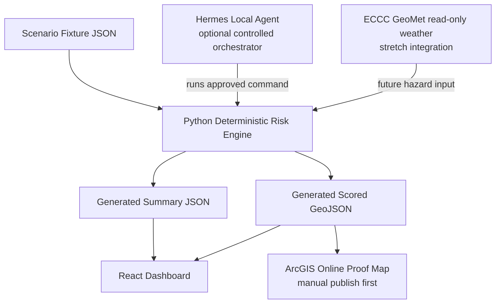

# GridLumen AI — Climate & Capacity Risk Radar
## Product, UX, Architecture, Data, Agent, and Solo Execution Design Specification

**Project:** Seneca Polytechnic Energy Hackathon 2026  
**Track:** Theme 2 — Smart Grid, Resilience and Electrification  
**Primary problem statement:** Problem Statement 2 — Infrastructure Vulnerability  
**Supporting scenario extension:** Problem Statement 3 — feeder capacity stress under EV charging and demand growth; Problem Statement 1 — weather-driven outage hotspot screening  
**Product status:** Hackathon prototype specification  
**Builder model:** One technical builder responsible for implementation and presentation; see the participation eligibility warning below.  
**Document purpose:** This file is the canonical specification for a coding IDE/agent and the builder. Implement the application from this document in the order stated. Do not introduce features or claims that conflict with the scope, data limitations, privacy model, or demo priorities described here.

---

## 0. Critical Eligibility Warning Before Building Solo

The public Seneca Hackathon FAQ states that teams must consist of **3 to 5 members**, and that when a member drops out a team may continue only while it still meets the minimum team size of 3. This design assumes a **solo builder/owner** for implementation efficiency; it does **not** establish eligibility to compete as a one-person team.

**Immediate non-development action:** contact the organizers or confirm in the Hackathon Portal whether you may submit alone, must be matched into a team, or may proceed under an existing registered team with inactive members. Do not wait until submission time.

This does not change the product plan: a solo builder can build the MVP, but competition eligibility must be confirmed separately.

---

## 1. Executive Summary

### 1.1 The idea

**GridLumen AI** is an explainable geospatial decision-support application for utility resilience planners. It identifies generalized neighbourhood zones where three pressures combine:

1. **Climate hazard exposure** — severe wind/rain, extreme heat, or flooding risk.
2. **Infrastructure exposure** — overhead-line/vegetation interaction or flood-sensitive infrastructure context.
3. **Capacity stress** — low remaining capacity margin under modeled load-growth scenarios such as evening EV charging plus cooling demand.

The app converts these signals into a ranked, map-based intervention queue: which zones should be reviewed, inspected, monitored, or considered for future capacity/resilience planning first.

### 1.2 Why this is the winning version of the concept

Most hackathon maps simply display hazards. GridLumen demonstrates a full decision workflow:

```text
Scenario selected
  → transparent risk computation
  → zones recoloured on a map
  → a planner clicks a red zone and sees exactly why it is red
  → the app recommends a prioritized mitigation action
  → a local Hermes run demonstrates repeatable generation of map-ready output
```

This is impressive without being dishonest. It avoids unsupported claims of predicting exact outages or transformer failures without labeled utility data. It uses a deterministic, auditable scoring method, which is appropriate for a prototype when proprietary asset history and failure labels are unavailable.

### 1.3 One-sentence product pitch

> **GridLumen AI reveals where climate exposure, infrastructure vulnerability, and shrinking capacity margin collide, giving utility planners an explainable priority list before the next emergency.**

### 1.4 What this application is not

GridLumen AI is **not**:

- an operational grid-control system;
- an outage guarantee or confirmed failure predictor;
- a public map of precise transformers, feeders, or sensitive utility assets;
- an automated dispatch platform;
- a production Alectra integration;
- a black-box ML model trained on unavailable outage records.

---

## 2. Challenge Alignment and Scope Lock

### 2.1 Primary alignment: Theme 2, Problem Statement 2

The solution targets **Infrastructure Vulnerability**. It directly implements the challenge directions:

- **Vulnerability Index:** the explainable GridLumen Priority Risk Score.
- **Risk Mapping Tool:** a map of generalized vulnerable zones styled Low/Elevated/Critical.
- **Upgrade Prioritization Framework:** a ranked intervention queue with immediate, preventive, and planning actions.
- **Above/Below-Ground Hazard Comparison:** infrastructure exposure can distinguish conceptual overhead vegetation exposure from flood-sensitive underground context.

### 2.2 Secondary alignment: scenario extensions only

The app includes two secondary ideas without becoming over-scoped:

- **Weather/storm extension from Problem Statement 1:** severe weather increases hazard risk in exposed zones.
- **EV/electrification extension from Problem Statement 3:** a heatwave plus evening EV charging scenario raises capacity stress.

The submission should always state that **Problem Statement 2 is primary**. The other problem statements improve the realism of the vulnerability index; they are not separate products.

### 2.3 Pilot geography

**Pilot location:** Mississauga, Ontario.

Reasons:

- the challenge brief lists Mississauga public layers as candidate data for infrastructure/hazard analysis;
- a municipal pilot keeps the demo focused and legible;
- generalized neighbourhood risk zones are appropriate for a privacy-aware prototype.

---

## 3. Product Truth: Real, Representative, and Future Data

The fastest way to lose credibility is to present demonstration data as operational truth. The interface, source documentation, demo narration, and pitch must distinguish these categories.

### 3.1 Data truth table

| Data concept | Prototype implementation | Claim permitted in demo | Claim prohibited |
|---|---|---|---|
| Generalized risk zones | Simplified illustrative Mississauga-area polygons | “Generalized pilot zones” | “Exact feeder boundaries” |
| Scenario weather severity | Hardcoded first; optional public ECCC read-only enhancement | “Modeled severe-storm/heatwave scenario” | “Live outage forecast” unless actually connected and labelled as live weather only |
| Flood/vegetation context | Optional real public layer or representative attribute | “Public hazard layer where integrated; representative otherwise” | “Utility-verified asset exposure” |
| Capacity stress | Representative capacity-margin values for MVP | “Scenario-based capacity-stress screening” | “Actual transformer overload prediction” |
| Asset locations | Not public; no exact assets in MVP | “Secured asset-level integration is a future deployment concept” | “We use real Alectra asset locations” |
| Historical outage labels | Not currently available | “Required for future model calibration” | “Trained predictive outage model” |
| Hermes agent | Optional controlled script orchestrator | “Runs an approved deterministic scenario script locally” | “Autonomously controls grid operations” |

### 3.2 Mandatory disclaimer in app and pitch

Every result panel and generated output must include:

> **Representative prototype data only; not an operational outage forecast or equipment-failure prediction.**

### 3.3 Privacy architecture

The public-facing demo shows only **generalized risk polygons** and action recommendations. The design may visually mention a locked “Secured Utility Layer” for a production deployment, but it must not reveal actual infrastructure assets or imply access to them.

---

## 4. Solo-Builder Winning Strategy

### 4.1 Build philosophy

For one builder, the winning approach is to prioritize a flawless narrative and stable demonstration over an overly ambitious integration stack.

**Non-negotiable core:**

1. Beautiful dashboard.
2. Three scenario toggles that visibly alter risk.
3. Deterministic risk engine producing explainable outputs.
4. Ranked intervention queue.
5. One map proof, either local/interactive in the web UI or an ArcGIS Online map built from exported GeoJSON.
6. Five-minute pitch with explicit data honesty and feasibility.

**Impressive but gated enhancement:**

7. Hermes runs the approved deterministic risk script locally and produces GeoJSON/summary output.

**Only build after the core is polished:**

8. Read-only public weather ingestion.
9. ArcGIS hosted-layer overwrite automation.
10. Any scheduled run or alert workflow.

### 4.2 Feature triage matrix

| Feature | Value to judges | Solo implementation risk | Decision |
|---|---:|---:|---|
| Dashboard with scenario map and intervention list | Very high | Low | Build first |
| Deterministic scoring engine and GeoJSON output | Very high | Low | Build first |
| ArcGIS Online styled layer/popup proof | High | Medium | Build after engine |
| Hermes local skill runs scoring script | High wow factor | Medium | Build after core works |
| Public ECCC weather read-only input | Medium/high | Medium | Stretch only |
| ArcGIS automatic updates | Medium | High | Roadmap unless trivial |
| Cron scheduling/notifications | Low for qualifying demo | High | Roadmap only |
| Black-box ML model/GNN | Low credibility without labels | Very high | Do not build |
| Chatbot | Distracts from planner workflow | Medium | Do not build |

### 4.3 Definition of “finished”

The solution is submission-ready when a judge can watch one uninterrupted walkthrough and understand:

- the exact utility planning problem;
- the explainable score formula;
- why a highlighted zone is high risk;
- the action recommended;
- what data is real versus representative;
- how production utility data could replace prototype inputs;
- why the tool is feasible and privacy-aware.

---

## 5. User and User Story

### 5.1 Primary persona

**Persona:** Utility resilience planner / distribution planning analyst  
**Context:** Preparing for extreme weather or assessing where electrification-driven demand could stress local distribution infrastructure.  
**Need:** Quickly understand where vulnerability is highest and which action deserves attention first.  
**Constraint:** The planner cannot rely on a black-box score or publicly expose sensitive asset detail.

### 5.2 Primary user story

> As a utility resilience planner, I want to select an extreme-weather or demand-growth scenario and view a prioritized map of vulnerable zones, so I can justify where inspections, mitigation, and planning resources should be directed first.

### 5.3 User journey


### 5.4 Primary decisions supported

| User decision | Screen evidence |
|---|---|
| Which zone needs immediate review during a storm? | Critical zones, driver breakdown, urgent action queue |
| Which zone becomes capacity stressed under heat/EV demand? | Scenario toggle and capacity-stress driver |
| Why is one zone ranked above another? | Formula, component scores, plain-language explanation |
| Is the app disclosing sensitive infrastructure? | Generalized map plus locked secured-layer concept |

---

## 6. UX and Visual Design Specification

### 6.1 UI character

The dashboard should feel like a calm, credible planning instrument—not a sci-fi command centre and not a generic student website.

| Attribute | Direction |
|---|---|
| Visual tone | Utility-grade, precise, trustworthy, modern |
| Layout | Desktop-first dashboard; responsive tablet/mobile fallback |
| Background | Soft light gray-blue surface with white cards |
| Header/map | Deep navy, high contrast |
| Colour role | Risk colours only for risk; avoid decorative red/amber/green elsewhere |
| Motion | Subtle scenario transition and selection outline only |
| Accessibility | Keyboard navigable controls, visible focus, colour + label redundancy |

### 6.2 Design tokens

| Token | Value |
|---|---|
| `--navy-950` | `#071A33` |
| `--navy-900` | `#0B2545` |
| `--blue-600` | `#1570EF` |
| `--cyan-400` | `#22D3EE` |
| `--surface` | `#F5F8FC` |
| `--card` | `#FFFFFF` |
| `--text-primary` | `#101828` |
| `--text-muted` | `#667085` |
| `--risk-low` | `#17B26A` |
| `--risk-elevated` | `#F79009` |
| `--risk-critical` | `#F04438` |
| `--border` | `#E4E7EC` |
| `--radius-card` | `16px` |
| Font | Inter, system fallback |

### 6.3 Application routes

The prototype should operate as a single-page dashboard with anchored sections. Routes are optional; stable navigation matters more than routing.

| Section/route | Purpose | Priority |
|---|---|---:|
| `/` Dashboard | Scenario control, KPIs, map, detail panel, action queue | Essential |
| `#methodology` | Scoring explanation and data limitations | Essential |
| `#architecture` | Agent/data/GIS production pathway | Essential |
| `#sources` | Public and representative data disclosure | Essential |
| `/agent-run` or modal | Recorded/actual Hermes run summary | Optional |

### 6.4 Desktop hero and dashboard wireframe

```text
┌──────────────────────────────────────────────────────────────────────────────┐
│ GridLumen AI | Climate & Capacity Risk Radar     Mississauga Pilot  PROTOTYPE │
│ Overview  Risk Map  Interventions  Methodology                  Export Brief │
├──────────────────────────────────────────────────────────────────────────────┤
│ Climate-ready grid planning before failure happens.                         │
│ Explainable zone prioritization for storms, heat, and demand stress.         │
│ [Normal] [Severe Wind & Rain Storm ✓] [Heatwave + Evening EV Demand]         │
│ Forecast Horizon: Next 24 Hours       Public Risk View   🔒 Secured Layer     │
├────────────────┬────────────────┬────────────────┬─────────────────────────┤
│ Critical Zones │ Zones to Review│ Peak Utilization│ Highest Priority         │
│ 3  ↑2 baseline │ 12 attributes  │ 76% modeled     │ Cooksville Central       │
├───────────────────────────────────────────────┬──────────────────────────────┤
│                                               │ SELECTED ZONE                │
│       MISSISSAUGA GENERALIZED RISK MAP        │ Cooksville Central           │
│                                               │ CRITICAL  87/100             │
│  polygons: green / amber / red                │ +26 vs normal                │
│  selected polygon: cyan outline               │                              │
│  optional overlays: storm / tree / flood      │ Risk drivers                 │
│                                               │ Wind exposure          +38  │
│  Legend: Low | Elevated | Critical            │ Infrastructure         +27  │
│                                               │ Capacity stress        +22  │
│                                               │                              │
│                                               │ Recommended action           │
│                                               │ Prioritize overhead          │
│                                               │ corridor inspection.         │
├───────────────────────────────────────────────┴──────────────────────────────┤
│ PRIORITY INTERVENTION QUEUE                                                   │
│ 1 Cooksville Central  Critical 87  Inspect overhead corridors    Immediate   │
│ 2 Meadowvale North    Critical 82  Stage demand monitoring         Immediate  │
│ 3 Port Credit East    Critical 78  Check flood-sensitive areas     Immediate  │
└──────────────────────────────────────────────────────────────────────────────┘
```

### 6.5 Components

| Component | Responsibilities | Essential states |
|---|---|---|
| `Header` | Branding, prototype badge, navigation, export placeholder | Static |
| `HeroControls` | Scenario toggle, forecast horizon, locked secure-layer CTA | Active scenario |
| `KpiCards` | Scenario metrics and priority summary | Values update by scenario |
| `RiskMap` | Render generalized polygons; selection and scenario styling | Loading, selected zone, fallback |
| `RiskLegend` | Explain Low/Elevated/Critical thresholds | Static |
| `ZoneDetailPanel` | Score, components, explanation, actions, disclaimer | Selected zone |
| `InterventionQueue` | Ranked zones; selecting row selects map zone | Sorted by risk |
| `MethodologySection` | Formula and three-factor explanation | Static |
| `DataDisclosureSection` | Real/representative/future data matrix | Static |
| `ArchitectureSection` | Pipeline diagram and Hermes role | Static |
| `AgentRunCard` | Actual/recorded local run evidence | Optional, never fake “live” |
| `Footer` | Theme and disclaimer | Static |

### 6.6 Interaction rules

1. Initial scenario is **Severe Wind & Rain Storm** because it is the most visually compelling and aligns with hazard vulnerability.
2. Initial selected zone is **Cooksville Central**.
3. Selecting a scenario updates KPI cards, risk polygon colours, selected zone default, details, and queue.
4. Clicking a polygon selects that zone and updates the detail panel and queue selection.
5. Clicking a queue row selects/highlights the same polygon.
6. Clicking the locked secured-layer control opens a modal stating that precise asset-level information is restricted to authorized deployments.
7. Every zone detail panel shows the representative-data disclaimer.
8. Never display `LIVE` unless a real weather feed has been implemented and it refers only to the weather layer, not the entire risk prediction system.

---

## 7. Demonstration Scenarios and Data Fixtures

### 7.1 Scoring model

The MVP uses a transparent weighted index. Each component is normalized from 0 to 100.

```text
Priority Risk Score = round(
    0.40 × Hazard Exposure
  + 0.30 × Infrastructure Exposure
  + 0.30 × Capacity Stress
)
```

Risk categories:

| Score | Category | Planner interpretation |
|---:|---|---|
| `0–49` | Low | Normal monitoring |
| `50–69` | Elevated | Schedule assessment or monitor closely |
| `70–100` | Critical | Prioritize mitigation review |

### 7.2 Component definitions

| Component | Meaning in MVP | Future production implementation |
|---|---|---|
| Hazard Exposure | Hardcoded scenario severity per zone | ECCC weather plus flood/storm overlays |
| Infrastructure Exposure | Representative susceptibility: overhead/vegetation/flood context | Authorized asset configuration plus GIS spatial intersections |
| Capacity Stress | Representative margin pressure under scenario | Utility-authorized capacity/loading values and planning limits |

### 7.3 Required zones

Use eight generalized zones for visual richness while maintaining an understandable demo:

1. Cooksville Central
2. Meadowvale North
3. Port Credit East
4. Streetsville West
5. Erin Mills
6. Malton Industrial
7. Clarkson South
8. City Centre

### 7.4 Scenario fixtures

These fixtures are the canonical MVP inputs. The risk engine must compute the output rather than hardcoding the result score in UI components.

#### Scenario A — Normal Conditions

| Zone | Hazard | Infrastructure | Capacity | Computed Score | Level | Primary driver/action |
|---|---:|---:|---:|---:|---|---|
| Meadowvale North | 50 | 72 | 100 | 72 | Critical | Low margin; review capacity planning |
| Cooksville Central | 45 | 82 | 63 | 62 | Elevated | Vegetation/overhead exposure; monitor |
| Port Credit East | 66 | 62 | 45 | 59 | Elevated | Water exposure; monitor flood context |
| Streetsville West | 40 | 75 | 50 | 54 | Elevated | Tree canopy overlap; schedule review |
| City Centre | 30 | 48 | 68 | 47 | Low | Dense demand; routine monitoring |
| Erin Mills | 35 | 45 | 48 | 42 | Low | Residential demand; routine monitoring |
| Malton Industrial | 30 | 40 | 53 | 40 | Low | Industrial demand; routine monitoring |
| Clarkson South | 41 | 40 | 32 | 38 | Low | Water context; routine monitoring |

#### Scenario B — Severe Wind & Rain Storm (default demo state)

| Zone | Hazard | Infrastructure | Capacity | Computed Score | Level | Primary driver/action |
|---|---:|---:|---:|---:|---|---|
| Cooksville Central | 95 | 90 | 73 | 87 | Critical | Wind + overhead + vegetation; inspect overhead corridors |
| Meadowvale North | 80 | 68 | 99 | 82 | Critical | Storm plus constrained margin; stage monitoring |
| Port Credit East | 94 | 88 | 48 | 78 | Critical | Rain/flood exposure; check flood-sensitive areas |
| Streetsville West | 72 | 76 | 45 | 65 | Elevated | Tree canopy overlap; schedule vegetation review |
| Clarkson South | 75 | 58 | 40 | 59 | Elevated | Water exposure; monitor |
| City Centre | 63 | 45 | 55 | 55 | Elevated | Dense demand; monitor |
| Erin Mills | 60 | 50 | 40 | 51 | Elevated | Storm exposure; monitor |
| Malton Industrial | 50 | 40 | 45 | 46 | Low | Continue monitoring |

#### Scenario C — Heatwave + Evening EV Demand

| Zone | Hazard | Infrastructure | Capacity | Computed Score | Level | Primary driver/action |
|---|---:|---:|---:|---:|---|---|
| Meadowvale North | 95 | 77 | 100 | 91 | Critical | EV demand + low margin; review load-relief strategy |
| City Centre | 90 | 55 | 94 | 81 | Critical | Cooling + density; monitor evening peak |
| Erin Mills | 72 | 50 | 85 | 69 | Elevated | Residential EV adoption; planning review |
| Cooksville Central | 68 | 65 | 65 | 66 | Elevated | Cooling demand; monitor threshold |
| Malton Industrial | 70 | 50 | 64 | 62 | Elevated | Commercial demand; evaluate margin |
| Streetsville West | 60 | 52 | 55 | 56 | Elevated | Residential demand; monitor evening peak |
| Clarkson South | 57 | 44 | 55 | 53 | Elevated | Heat demand; monitor |
| Port Credit East | 60 | 40 | 40 | 48 | Low | Continue routine monitoring |

### 7.5 KPI metrics by scenario

| KPI | Normal | Severe storm | Heatwave + EV |
|---|---:|---:|---:|
| Critical zones | 1 | 3 | 2 |
| Elevated zones | 3 | 4 | 5 |
| Zones requiring review (`Elevated + Critical`) | 4 | 7 | 7 |
| Peak capacity utilization display | 71% modeled | 76% modeled | 94% modeled |
| Default selected zone | Meadowvale North | Cooksville Central | Meadowvale North |
| Top recommended action | Review capacity margin | Inspect overhead corridors | Review load-relief strategy |

---

## 8. Technical Architecture

### 8.1 Architecture principle

Build the production-looking demo as a static, resilient application driven by deterministic generated files. External services and Hermes must enhance, never block, the primary walkthrough.



### 8.2 MVP stack decision

| Layer | Technology | Why this choice |
|---|---|---|
| Web app | React + TypeScript + Vite | Fast static UI, easy coding-IDE generation, reliable demo deployment |
| Styling | Tailwind CSS + small reusable UI component library | Fast polished dashboard styling |
| Icons | Lucide React | Clean operations-dashboard visuals |
| Charts | Recharts only if needed for driver bars | Lightweight explainability visuals |
| Map MVP | Local SVG/GeoJSON renderer or simple map adapter | Guaranteed demo without credentials |
| GIS proof | ArcGIS Online hosted feature layer from generated GeoJSON | Sponsor-aligned geospatial evidence |
| Risk engine | Python 3.12 script | Auditable, easy to explain, produces portable GeoJSON |
| Optional spatial extension | GeoPandas + Shapely | Only when adding real vector overlays |
| Agent proof | Hermes Agent in WSL2 + local Ollama endpoint | Controlled local orchestration demonstration |
| Local model | `gridlumen-hermes:latest` via Ollama | Already configured locally; agent reasoning is not score source-of-truth |
| Hosting | Static deployment such as Vercel/Netlify or local recording | No backend dependency in judging demo |
| Source control | GitHub | Reproducibility and artifact attribution |

### 8.3 Why the UI should not depend on Hermes at runtime

The website is the submission artifact judges must see functioning. Hermes is an auxiliary orchestration proof. If the model is slow, cannot call a tool, or loses configuration, the web demo must still function perfectly from pre-generated scenario files.

**Rule:** do not create a web API endpoint that requires Hermes or Ollama to be online for the main dashboard.

### 8.4 Runtime modes

| Mode | Description | Used for |
|---|---|---|
| `demo` | Static JSON/GeoJSON scenario files; no network requirements | Main video walkthrough and website |
| `arcgis` | Display/publish generated layer in ArcGIS Online | GIS proof segment |
| `agent` | Hermes executes local engine to regenerate outputs | Recorded wow-factor segment |
| `public-weather` | ECCC data read-only input for hazard component | Optional stretch; label carefully |

---

## 9. Repository Specification

### 9.1 Required project structure

```text
gridlumen-ai/
├── DESIGN.md                              # This canonical specification
├── README.md                              # Setup, demo commands, truthful product description
├── .gitignore
├── web/
│   ├── package.json
│   ├── vite.config.ts
│   ├── src/
│   │   ├── App.tsx
│   │   ├── main.tsx
│   │   ├── components/
│   │   │   ├── Header.tsx
│   │   │   ├── HeroControls.tsx
│   │   │   ├── KpiCards.tsx
│   │   │   ├── RiskMap.tsx
│   │   │   ├── ZoneDetailPanel.tsx
│   │   │   ├── InterventionQueue.tsx
│   │   │   ├── MethodologySection.tsx
│   │   │   ├── DataDisclosureSection.tsx
│   │   │   ├── ArchitectureSection.tsx
│   │   │   ├── AgentRunCard.tsx
│   │   │   └── Footer.tsx
│   │   ├── data/
│   │   │   ├── loadScenarios.ts
│   │   │   └── types.ts
│   │   ├── hooks/
│   │   │   └── useScenario.ts
│   │   └── styles/
│   │       └── index.css
│   └── public/
│       └── data/generated/              # Synced/copy of engine outputs
│           ├── summary_normal.json
│           ├── summary_storm.json
│           ├── summary_heatwave_ev.json
│           ├── scored_zones_normal.geojson
│           ├── scored_zones_storm.geojson
│           └── scored_zones_heatwave_ev.geojson
├── engine/
│   ├── pyproject.toml or requirements.txt
│   ├── data/
│   │   ├── demo/
│   │   │   ├── zones.geojson
│   │   │   └── scenarios.json
│   │   └── sources.md
│   ├── gridlumen/
│   │   ├── __init__.py
│   │   ├── risk_engine.py
│   │   ├── models.py
│   │   ├── scoring.py
│   │   └── geojson_export.py
│   ├── output/
│   └── tests/
│       └── test_scoring.py
├── arcgis/
│   ├── PUBLISHING_GUIDE.md
│   ├── POPUP_FIELDS.md
│   └── screenshots/
├── hermes/
│   ├── SKILL.md
│   └── HERMES_DEMO_SCRIPT.md
├── docs/
│   ├── DATA_DISCLOSURE.md
│   ├── SECURITY_SCOPE.md
│   ├── SOURCE_ATTRIBUTIONS.md
│   └── DECISION_LOG.md
└── pitch/
    ├── FIVE_MINUTE_SCRIPT.md
    ├── RECORDING_CHECKLIST.md
    └── SLIDE_OUTLINE.md
```

### 9.2 Environment variables

The application must run without secrets in `demo` mode.

```bash
# web/.env.example
VITE_DATA_MODE=demo
VITE_MAP_MODE=demo
VITE_ARCGIS_WEBMAP_ID=
VITE_SHOW_AGENT_CARD=true

# never commit credentials
# VITE_ARCGIS_API_KEY=
```

Hermes/Ollama configuration should remain outside the repository. Never commit API keys or personal model configuration.

---

## 10. Data Contracts

### 10.1 TypeScript scenario types

The coding IDE should implement types equivalent to:

```ts
export type ScenarioId = "normal" | "storm" | "heatwave_ev";
export type RiskLevel = "Low" | "Elevated" | "Critical";

export interface RiskZoneProperties {
  zone_id: string;
  zone_name: string;
  scenario: ScenarioId;
  hazard_score: number;
  infrastructure_score: number;
  capacity_score: number;
  risk_score: number;
  risk_level: RiskLevel;
  primary_driver: string;
  recommended_action: string;
  urgency: "Routine" | "Medium" | "High" | "Immediate";
  prototype_data: true;
  disclaimer: string;
}

export interface ScenarioSummary {
  scenario: ScenarioId;
  display_name: string;
  generated_at: string | null;
  data_mode: "representative" | "public_weather_enhanced";
  formula: string;
  critical_zones: number;
  elevated_zones: number;
  peak_capacity_utilization_percent: number;
  default_selected_zone_id: string;
  priority_zones: RiskZoneProperties[];
  disclaimer: string;
}
```

### 10.2 GeoJSON output schema

Each GeoJSON feature uses polygon geometry and the fields above. Coordinate data must be generalized demonstration geometry and not claimed as precise utility topology.

```json
{
  "type": "FeatureCollection",
  "features": [
    {
      "type": "Feature",
      "geometry": {
        "type": "Polygon",
        "coordinates": [[[-79.626, 43.580], [-79.611, 43.580], [-79.611, 43.594], [-79.626, 43.594], [-79.626, 43.580]]]
      },
      "properties": {
        "zone_id": "cooksville-central",
        "zone_name": "Cooksville Central",
        "scenario": "storm",
        "hazard_score": 95,
        "infrastructure_score": 90,
        "capacity_score": 73,
        "risk_score": 87,
        "risk_level": "Critical",
        "primary_driver": "Wind + overhead + vegetation",
        "recommended_action": "Prioritize overhead corridor inspection",
        "urgency": "Immediate",
        "prototype_data": true,
        "disclaimer": "Representative prototype data only; not an operational outage forecast or equipment-failure prediction."
      }
    }
  ]
}
```

### 10.3 Source-of-truth hierarchy

1. `engine/data/demo/scenarios.json` is the authoritative fixture input.
2. Python engine computes score and classification.
3. Generated JSON and GeoJSON are copied into `web/public/data/generated/`.
4. Frontend never independently recalculates scores; it renders generated outputs.
5. Hermes may invoke the engine but may never edit data, formula, or output fields during the demo.

---

## 11. Python Risk Engine Specification

### 11.1 Functional requirements

The engine must:

- accept one of three scenario IDs from the command line;
- read fixture inputs and generalized polygons;
- compute risk scores with the fixed formula;
- classify each zone by threshold;
- rank zones descending by risk score;
- generate a summary JSON file and scored GeoJSON file;
- include the mandatory disclaimer in every output;
- run deterministically: identical input always yields identical output.

### 11.2 Required CLI

```bash
cd engine
python -m gridlumen.risk_engine --scenario normal
python -m gridlumen.risk_engine --scenario storm
python -m gridlumen.risk_engine --scenario heatwave_ev
```

Optional convenience command:

```bash
python -m gridlumen.risk_engine --all --copy-to-web
```

### 11.3 Scoring pseudocode

```python
WEIGHTS = {
    "hazard_score": 0.40,
    "infrastructure_score": 0.30,
    "capacity_score": 0.30,
}

def score_zone(zone):
    score = round(
        zone.hazard_score * WEIGHTS["hazard_score"]
        + zone.infrastructure_score * WEIGHTS["infrastructure_score"]
        + zone.capacity_score * WEIGHTS["capacity_score"]
    )
    if score >= 70:
        level = "Critical"
    elif score >= 50:
        level = "Elevated"
    else:
        level = "Low"
    return score, level
```

### 11.4 Validation tests

| Test | Required assertion |
|---|---|
| Formula determinism | Same fixture returns same scores every run |
| Threshold at 49 | Low |
| Threshold at 50 | Elevated |
| Threshold at 70 | Critical |
| Storm ranking | Cooksville is first, risk score 87 |
| Heatwave ranking | Meadowvale is first, risk score 91 |
| Output completeness | Each feature contains required fields and disclaimer |
| Privacy guard | Output has no `transformer_id`, `feeder_id`, coordinates labelled as real, or utility credential fields |

---

## 12. Frontend Implementation Specification

### 12.1 Application state

The UI needs only two primary state variables:

```ts
const [scenario, setScenario] = useState<ScenarioId>("storm");
const [selectedZoneId, setSelectedZoneId] = useState<string>("cooksville-central");
```

On scenario change, load the associated summary/GeoJSON and reset selection to that scenario’s `default_selected_zone_id`.

### 12.2 Scenario-loading behaviour

```text
User selects scenario
  → fetch /data/generated/summary_<scenario>.json
  → fetch /data/generated/scored_zones_<scenario>.geojson
  → set KPI values
  → set map colour categories
  → set default selected zone
  → render sorted intervention queue
```

The app should preload all three JSON/GeoJSON pairs on initial load if feasible so scenario switching feels instant.

### 12.3 Map implementation strategy

#### MVP map: guaranteed demo mode

Implement a reliable map rendering mode that does not require a login, API key, or live service. Options, in priority order:

1. Render generalized GeoJSON polygons with a lightweight React mapping component or an SVG projection.
2. Preserve labels and selected-zone outlines.
3. Use risk-level colours and optional static hazard icons.

This mode is used for the recorded dashboard walkthrough.

#### ArcGIS proof mode

Separately publish one generated GeoJSON layer to ArcGIS Online, style by `risk_level`, and configure popups. Embed or screen-record this proof only once stable. Do not allow an ArcGIS outage/login issue to break the main demo website.

### 12.4 Zone detail panel content

For any selected zone, render:

- zone name and “Generalized Grid Risk Area” label;
- score and risk badge;
- delta from baseline if available;
- three horizontal component bars;
- plain-language explanation generated from fixed template, not LLM inference;
- recommended action and urgency;
- mandatory disclaimer.

Example template for storm/Cooksville:

> This zone is prioritized because the severe-storm scenario combines high wind exposure with overhead/vegetation vulnerability. Capacity pressure contributes to risk but is not presented as a confirmed overload or failure.

### 12.5 Intervention queue

Queue is sorted descending by `risk_score`. Table columns:

| Rank | Zone | Status/Score | Primary Driver | Recommended Action | Urgency |
|---:|---|---|---|---|---|

Rows must be clickable and keyboard accessible. A selected row should highlight the matching polygon and detail panel.

### 12.6 Methodology and honesty section

The web page must include a visible methodology section below the main workspace explaining:

- the formula;
- what each component means;
- that component values are representative during the prototype;
- how utility-approved data would replace those inputs in production;
- why black-box failure prediction is deliberately not claimed.

### 12.7 Agent demonstration card

Only show the Hermes card once the agent actually works. The card should say:

```text
Automated Analysis Proof
Orchestrator: Hermes Agent, local model endpoint
Method: Approved deterministic Python scoring run
Output: map-ready GeoJSON + ranked JSON summary
Status: Demonstrated locally / Recorded run available
```

Do not show timestamps or “auto-refresh” unless they reflect an actual recorded/tested run.

---

## 13. ArcGIS Online Proof Specification

### 13.1 Why ArcGIS is included

The app is a geospatial risk prioritization solution. ArcGIS Online demonstrates that the output is not merely a mock UI: the computed GeoJSON can become a real styled hosted feature layer with click-through popups.

### 13.2 Minimum ArcGIS deliverable

1. Publish `scored_zones_storm.geojson` as a hosted feature layer.
2. Style features by `risk_level`:
   - Low = green;
   - Elevated = amber;
   - Critical = red.
3. Configure popup fields:
   - `zone_name`;
   - `risk_score`;
   - `risk_level`;
   - `primary_driver`;
   - `recommended_action`;
   - `disclaimer`.
4. Save the web map with title:

```text
GridLumen AI — Mississauga Climate & Capacity Risk Radar
```

5. Capture a clean screenshot or short recording for the pitch.

### 13.3 ArcGIS automation is stretch scope

Programmatic overwriting of hosted layers is not required for the winning MVP. It may be implemented only when the static dashboard, Python output, manual ArcGIS map, and pitch recording are complete.

### 13.4 Public versus secured visualization

The public map displays generalized zones only. A locked UI control may communicate the future production concept:

> Precise asset-level infrastructure detail would be visible only in an authorized utility deployment.

No real sensitive layer should be stored in the demo.

---

## 14. Hermes Agent Specification

### 14.1 Current environment assumption

The local builder environment has successfully established:

- Windows-hosted Ollama v0.17.7;
- `gridlumen-hermes:latest`, based on Hermes 3 8B with 64,000 context setting;
- WSL2 access to `http://127.0.0.1:11434/v1`;
- Hermes Agent installed in WSL2 and being configured for the custom endpoint.

Before relying on Hermes in the demo, confirm this passes:

```bash
hermes chat -q "Answer with exactly one word: READY"
```

### 14.2 Hermes role

Hermes is **not** the risk model. Hermes is an orchestrator that demonstrates repeatable execution of an approved risk-analysis procedure.

```text
Hermes prompt
  → loads fixed GridLumen skill
  → runs deterministic Python command
  → reads generated summary JSON
  → reports ranked zones and output path
```

### 14.3 Approved skill file

Store a copy in `hermes/SKILL.md` and, for local execution, place it in the Hermes skills directory according to the installed Hermes configuration.

```markdown
---
name: gridlumen-risk-demo
description: Runs approved GridLumen deterministic risk scenarios and summarizes map-ready outputs.
version: 0.1.0
---

# GridLumen Risk Demo

## Allowed scenarios
- normal
- storm
- heatwave_ev

## Allowed actions
Run exactly one approved command matching the user request:

```bash
cd /home/azizr/gridlumen-ai/engine && python -m gridlumen.risk_engine --scenario normal
cd /home/azizr/gridlumen-ai/engine && python -m gridlumen.risk_engine --scenario storm
cd /home/azizr/gridlumen-ai/engine && python -m gridlumen.risk_engine --scenario heatwave_ev
```

Read only the generated JSON output for the selected scenario and report:
- ranked critical/elevated zones;
- primary drivers;
- recommended actions;
- GeoJSON output path.

Always include:
“Representative prototype data only; not an operational outage forecast or equipment-failure prediction.”

## Prohibited actions
- Do not change code, data, thresholds, or weights.
- Do not call external APIs.
- Do not upload files or access ArcGIS credentials.
- Do not send alerts or schedule recurring jobs.
- Do not describe generalized zones as actual utility asset locations.
- Do not claim confirmed outages, overloads, or failures.
```

### 14.4 Safe agent test sequence

1. Test local chat only.
2. Test harmless file read/write in a sandbox directory.
3. Run engine manually and inspect generated outputs.
4. Install/enable fixed skill.
5. Run the skill with `storm` scenario.
6. Screen record successful output for the pitch.
7. Never enable unsupervised cron or cloud write operations for the qualifying demo.

### 14.5 Agent demo narrative

Use this sentence:

> “Rather than asking an LLM to invent infrastructure risk, GridLumen uses Hermes only to orchestrate a deterministic, auditable scoring pipeline and summarize map-ready outputs.”

---

## 15. Optional Real Data Enhancement: ECCC GeoMet

### 15.1 Purpose

If the core demo is complete, add a read-only environmental data enhancement to demonstrate that the hazard component could consume public meteorological information.

### 15.2 Allowed claim

> “This prototype can ingest public ECCC weather information to inform the hazard-exposure component.”

### 15.3 Prohibited claim

Do not state that weather ingestion alone creates an operational outage forecast or verified risk probability.

### 15.4 Implementation boundary

Implement weather retrieval as a separate provider interface:

```python
class HazardProvider(Protocol):
    def hazard_scores_for_scenario(self, scenario: str) -> dict[str, int]: ...

class DemoHazardProvider:
    # reads fixture inputs

class PublicWeatherHazardProvider:
    # future/read-only ECCC transformation with documented assumptions
```

If API integration is not stable within a strict timebox, keep the demo provider and list ECCC integration as the next pilot step.

---

## 16. Build Plan for One Person

### 16.1 Implementation order is non-negotiable

Do not begin optional integrations until all prior gates are complete.

| Phase | Timebox | Goal | Exit criterion |
|---|---:|---|---|
| 0. Eligibility + repo | 20–30 min | Confirm solo/team eligibility path; create repository and this design file | Organizer contacted/portal verified; repo initialized |
| 1. Engine fixtures | 60–90 min | Scenario JSON, generalized zones, Python scoring/export | Three valid JSON + GeoJSON outputs |
| 2. Dashboard shell | 2–3 hours | Header, controls, KPIs, map, panel, queue | Full storm scenario visually works |
| 3. Scenario interactivity | 60–90 min | All three toggles and zone selection | Instant, stable state transitions |
| 4. Methodology/credibility | 45–60 min | Formula, data truth, privacy sections | No unsupported claims in UI |
| 5. ArcGIS proof | 45–90 min | Upload styled GeoJSON and popups | Screen-recordable web map |
| 6. Hermes proof | 45–90 min | Run fixed skill locally | Recorded successful deterministic run |
| 7. Polish + recording | 2–3 hours | Story, QA, video, attribution | Submission-ready five-minute video |
| 8. Stretch | Only after complete | ECCC read-only/weather or layer overwrite | Must not threaten recording |

### 16.2 Kill criteria

Stop a feature and move on when any of the following occurs:

| Feature | Kill after | Fallback |
|---|---:|---|
| Hermes configuration/tool execution | 60 minutes additional debugging | Present architecture and run engine manually |
| ArcGIS embedding into main website | 45 minutes | Screen-record ArcGIS map separately; keep reliable local map UI |
| Live weather transformation | 60 minutes | Use documented scenario fixture; cite public source as pilot integration |
| Auto GIS layer update | 30 minutes | Manual GeoJSON publish only |
| New ML model | Immediately | Explain why deterministic score is appropriate |

### 16.3 Solo quality bar

One clean working pathway wins over five half-built components:

```text
Select Storm → Map turns red in credible zones → Click Cooksville → Explain why → Show intervention → Show ArcGIS proof → Show optional agent run → Close with production pathway.
```

---

## 17. Coding IDE Implementation Instructions

The coding IDE must follow these rules:

1. Read this file before generating project code.
2. Scaffold the repository exactly enough to implement the required MVP; avoid unnecessary frameworks or authentication.
3. Implement deterministic engine and fixture outputs before frontend styling.
4. Frontend consumes generated output files; it does not fabricate risk values.
5. Use the three canonical scenarios and eight zones exactly as defined here unless the human builder approves a change.
6. Use generalized geometry only; never label it as real utility asset data.
7. Place the prototype disclaimer visibly in the UI and output files.
8. Never add an AI chatbot.
9. Never create ArcGIS write integrations, secrets, alerts, or scheduled jobs without explicit human approval after MVP completion.
10. Create clear `README.md` commands and tests for any implemented feature.
11. Keep the application functional without network access in `demo` mode.
12. Prefer production-looking polish and reliable demo flow over feature breadth.

### 17.1 Initial coding IDE task prompt

Give the IDE this instruction together with `DESIGN.md`:

```text
Implement Phase 1 and Phase 2 of DESIGN.md only. Create a Vite React TypeScript frontend and a Python deterministic engine. Generate the three canonical scenario JSON/GeoJSON outputs from fixtures and build the first operational dashboard screen for the default severe-storm scenario. The app must load generated data, display KPI cards, risk-coloured generalized map zones, selected-zone detail, and ranked intervention queue. Do not implement Hermes, ArcGIS API calls, live weather, authentication, uploads, alerts, or scheduling yet. Include tests for the scoring formula and required output fields. Preserve the representative-data disclaimer visibly in the UI.
```

### 17.2 Second coding IDE task prompt after MVP passes

```text
Implement the remaining non-network UI sections from DESIGN.md: scenario switching, methodology, data/privacy disclosure, architecture and responsive layout. Keep all data sourced from generated JSON/GeoJSON. Add a disabled locked Secured Utility Layer modal. Do not add external integrations.
```

### 17.3 Third task only after visual MVP is stable

```text
Prepare ArcGIS proof artifacts and Hermes files from DESIGN.md without changing the web demo dependency model. Add arcgis/PUBLISHING_GUIDE.md, hermes/SKILL.md, and pitch recording checklists. Do not add credentials or runtime ArcGIS/Hermes dependencies to the frontend.
```

---

## 18. Testing and Acceptance Criteria

### 18.1 Engine acceptance criteria

- [ ] Three scenarios execute deterministically.
- [ ] Computed values match the fixture tables in this document.
- [ ] All generated features contain disclaimer and `prototype_data: true`.
- [ ] No exact utility asset identifiers appear in outputs.
- [ ] Unit tests cover score formula and classification boundaries.

### 18.2 UI acceptance criteria

- [ ] Dashboard loads with Storm scenario and Cooksville selected.
- [ ] Four KPI cards match the active scenario.
- [ ] Scenario toggles change zones, rankings, and details.
- [ ] Selecting map zone or queue row synchronizes selection.
- [ ] Critical/Elevated/Low colours are accessible and accompanied by labels.
- [ ] Disclaimer is visible without scrolling away from the selected result.
- [ ] Methodology explains formula and data status.
- [ ] Secure-layer interaction clearly states it is conceptual/restricted.
- [ ] App works with no internet connection in demo mode.

### 18.3 ArcGIS proof acceptance criteria

- [ ] One generated GeoJSON is successfully published/styled.
- [ ] Popups display risk score, driver, action, and disclaimer.
- [ ] A screenshot or recording is captured in case internet/login fails during video editing.

### 18.4 Hermes proof acceptance criteria

- [ ] Hermes reaches the local Ollama custom endpoint.
- [ ] Hermes performs one fixed skill run without changing files outside output scope.
- [ ] Summary matches Python-generated output.
- [ ] Recording demonstrates the agent as an orchestrator, not score inventor.

### 18.5 Pitch acceptance criteria

- [ ] Video is at normal speed and does not exceed official qualifying time limit.
- [ ] Scope is explicitly Theme 2 Problem Statement 2.
- [ ] Real vs representative data is explained.
- [ ] Feasibility, privacy, and unique value are clear.
- [ ] No unsupported operational or prediction claims are made.
- [ ] Source and open-source/API attributions are included in repository or final slide.

---

## 19. Five-Minute Pitch Blueprint

### 19.1 Sequence

| Time | Visual | Narration goal |
|---:|---|---|
| `0:00–0:25` | Product title + problem | Extreme weather and electrification expose planning blind spots |
| `0:25–0:55` | Three-risk-factor graphic | Define hazard, infrastructure, and capacity collision |
| `0:55–1:20` | Dashboard baseline | Introduce Mississauga pilot and explainable index |
| `1:20–2:15` | Toggle storm; click Cooksville | Show map change, risk drivers, immediate action |
| `2:15–2:55` | Toggle heatwave + EV; click Meadowvale | Show capacity-stress extension |
| `2:55–3:25` | Intervention queue | Explain planner decision value |
| `3:25–3:50` | ArcGIS proof map | Demonstrate map-ready spatial workflow |
| `3:50–4:15` | Hermes recorded run, if successful | Show controlled reproducible orchestration |
| `4:15–4:40` | Data/privacy/methodology | Establish credibility and future integration path |
| `4:40–5:00` | Closing impact slide | Explain why it is practical and valuable |

### 19.2 Opening script

> “Extreme weather and electrification do not strain every part of a distribution system equally. Planners need to know which neighbourhood zones combine high hazard exposure, vulnerable infrastructure context, and limited capacity margin before scarce resilience resources are deployed. GridLumen AI is an explainable Climate and Capacity Risk Radar built for that decision.”

### 19.3 Hermes script, only if it works

> “The agent does not invent risk or control the grid. Hermes triggers our approved deterministic analysis, which produces map-ready GeoJSON and a ranked intervention summary. This demonstrates a controlled path toward repeatable screening workflows.”

### 19.4 Closing script

> “GridLumen does not replace utility engineers or claim confirmed failures. It helps them act earlier by making vulnerability understandable, spatial, and prioritizable—so the most exposed zones receive attention first.”

---

## 20. Risks, Mitigations, and Decision Log

### 20.1 Technical/project risks

| Risk | Likelihood | Impact | Mitigation |
|---|---:|---:|---|
| Solo eligibility is not permitted | High enough to act now | Critical | Contact organizers immediately; retain solo build plan but secure valid team status |
| Hermes tool run is unstable/slow | Medium | Medium | Make it an optional recorded proof; web app remains static and reliable |
| ArcGIS integration consumes time | Medium | Medium | Publish one GeoJSON manually; keep local map in web demo |
| Live weather mapping not ready | Medium | Low/medium | Use representative scenario and cite planned public integration |
| Judges perceive invented data | Medium | High | Always label demonstration values, show formula and future data pathway |
| Overclaiming “AI” or “prediction” | Medium | High | Use explainable risk-screening language consistently |

### 20.2 Decisions locked by this document

| Decision | Rationale |
|---|---|
| One primary problem statement: Infrastructure Vulnerability | Tight, judge-friendly alignment |
| Deterministic risk score instead of ML failure classifier | No confirmed labeled outage data; transparent and feasible |
| Static web MVP independent of agent and ArcGIS services | Reliable solo demo |
| ArcGIS as output proof, initially manual | Sponsor alignment without cloud/API fragility |
| Hermes as controlled orchestrator only | Adds AI value without compromising correctness |
| Representative capacity/asset data clearly disclosed | Credibility and privacy |

---

## 21. Sources and Attribution Plan

### 21.1 Challenge grounding

- `theme-2-challenge-set-02.pdf` supplied for the hackathon: establishes Theme 2, infrastructure vulnerability, risk mapping, upgrade prioritization, weather/vegetation/feeder concepts, and feeder overload/EV scenario possibilities.

### 21.2 External technical sources to cite in project repository or submission materials

| Source | Relevance | Reference |
|---|---|---|
| Seneca Hackathon FAQ | Participation, AI-tool responsibility, qualifying video requirements and third-party attribution | `https://www.senecahackathon.com/faqs` |
| ECCC / MSC GeoMet OGC API | Potential public weather/climate input | `https://api.weather.gc.ca/` |
| ArcGIS Online hosted feature layer documentation | GeoJSON-to-map proof workflow | `https://doc.arcgis.com/en/arcgis-online/manage-data/publish-features.htm` |
| Ollama Hermes integration documentation | Local agent/model endpoint setup | `https://docs.ollama.com/integrations/hermes` |
| Hermes Agent repository/documentation | Agent/skills implementation and license attribution | `https://github.com/nousresearch/hermes-agent` |

### 21.3 Attribution rule

Any dependency, API, public data layer, icon pack, basemap, or AI-generated content included in the project must be attributed in `docs/SOURCE_ATTRIBUTIONS.md` before submission. The builder must understand and be able to explain all implemented code and AI-assisted content.

---

## 22. Final Build Checklist

### Eligibility and project control

- [ ] Confirm whether a one-person submission is allowed or establish a valid 3–5 member team arrangement.
- [ ] Record exact portal submission deadline.
- [ ] Initialize repository and commit this `DESIGN.md`.

### Core solution

- [ ] Create fixture data and generalized polygons.
- [ ] Implement deterministic engine with tests.
- [ ] Generate all three JSON and GeoJSON outputs.
- [ ] Build polished web dashboard and scenario switching.
- [ ] Add data disclosure, methodology, privacy language.

### Spatial and agent proof

- [ ] Publish/stylize one ArcGIS layer or record a stable map proof.
- [ ] Confirm Hermes local model connection.
- [ ] Run fixed skill once successfully or remove it from demo claims.
- [ ] Record proof clips as soon as they work.

### Submission polish

- [ ] Write and rehearse five-minute pitch.
- [ ] Verify every claim against implemented functionality.
- [ ] Add sources/licenses/attributions.
- [ ] Capture backup screenshots/video assets.
- [ ] Submit before deadline.

---

## 23. Final North-Star Principle

A winning solo GridLumen submission is not the app with the most autonomous features. It is the app that makes judges say:

> “This person understood the utility problem, chose an honest analytical approach, used geospatial technology well, built a credible decision workflow, and showed exactly how it could grow into a real pilot.”

Build the explainable, map-driven workflow first. Treat Hermes and live data as controlled enhancements that support the story only after the core demo is undeniable.
